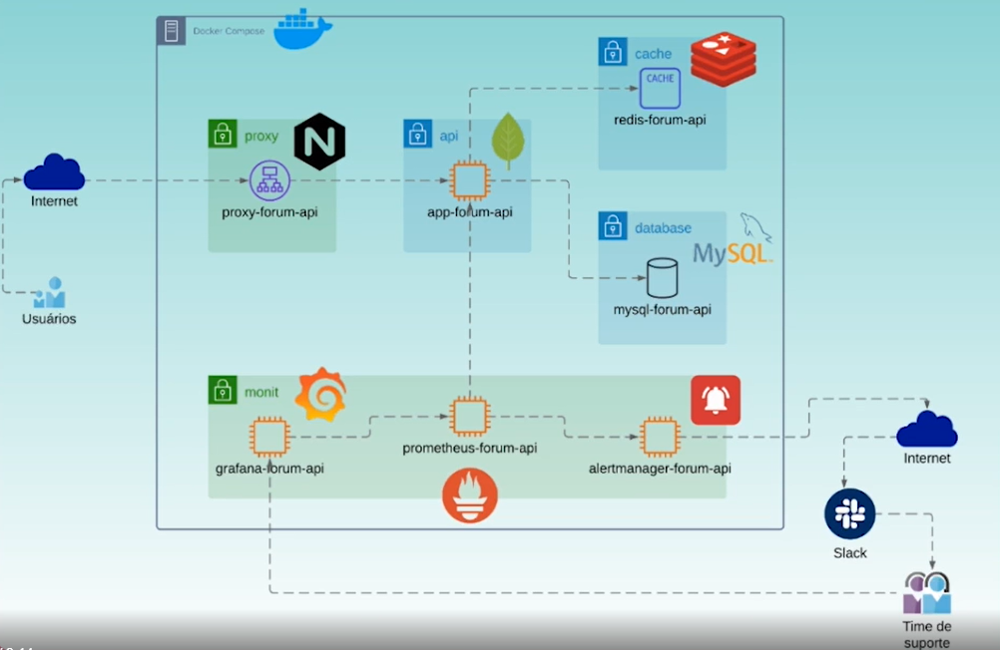

## Arquitetura

Todos os componentes estão rodando containerizados

Resumo:
- Prometheus: bate na forum-api (scrape) e coleta as métricas
- Grafana: consome as métricas que estão no Prometheus e apresenta gráficos
- Alertmanager: quando os alertas configurados no Prometheus forem acionados, 
o Prometheus irá envia o alerta para o alertmanager

## Spring Boot Actuator

Nesse projeto utilizamos o Spring Boot Actuator, que é um módulo que fornece recursos 
adicionais para monitoramento e gerenciamento de aplicativos Spring Boot. 
Um dos recursos do Spring Boot Actuator é a exposição de vários "endpoints" que fornecem 
informações sobre o estado e a saúde do aplicativo. Esses endpoints podem ser configurados 
no arquivo application.properties assim:

    # actuator
    management.endpoint.health.show-details=always
    management.endpoints.web.exposure.include=health,info,metrics

E, por padrão, fornecem informações detalhadas sobre o aplicativo.

Apartir disso, quando acessamos o endpoint `/actuator`, o Spring Boot Actuator retorna 
um JSON com informações sobre todos os endpoints que configuramos (health,info,metrics):

Com isso o endpoint `/actuator/metrics` retorna métricas relacionadas ao desempenho e uso 
de recursos do aplicativo. As métricas são fornecidas em formato JSON e abrangem informações 
como uso de CPU, memória, solicitações HTTP e conexões de banco de dados:

O endpoint `/actuator/health` fornece informações sobre o estado de saúde do aplicativo.
Relata o status de componentes, como banco de dados, cache e outros, como "UP" ou "DOWN".

O Spring Boot Actuator fornece informações detalhadas sobre o estado do aplicativo de forma 
automática e sem configuração extensa, graças à sua capacidade de autoconfiguração e detecção 
de bibliotecas no classpath. Ele ativa automaticamente endpoints, como `/actuator/metrics` e 
_/actuator/health_, com base nas bibliotecas presentes no projeto, permitindo que você acesse 
métricas de desempenho e informações de saúde sem a necessidade de configuração manual. 
Isso simplifica o monitoramento e o gerenciamento de aplicativos Spring Boot.

### E se eu não estiver utilizando recurso do Spring?

Se você estiver, por exemplo, usando um serviço de cache personalizado, implementado 
manualmente e não estiver usando os recursos de cache do Spring, o Spring Boot Actuator 
não irá automaticamente detectar nem fornecer métricas específicas para esse serviço de 
cache personalizado.

Os endpoints de métricas fornecidos pelo Spring Boot Actuator geralmente estão relacionados 
às bibliotecas e componentes padrão usados em aplicativos Spring Boot, **para obter métricas 
específicas para o serviço de cache personalizado, precisariamos implementar esse 
monitoramento manualmente**.

### Configurando Prometheus no Actuator

Colocando essa configuração no application.properties

    # prometheus
    management.metrics.enable.jvm=true
    management.metrics.export.prometheus.enabled=true
    management.metrics.distribution.sla.http.server.requests=50ms,100ms,200ms,300ms,500ms,1s
    management.metrics.tags.application=app-forum-api

Teremos um endpoint na aplicação chamado `/actuator/prometheus`, nesse endpoint tem todas as 
métricas e as informações:

É nesse endpoint que o Prometheus vai fazer o scrape para coletar as métricas.

## Prometheus

Prometheus é uma ferramenta de monitoramento que se concentra principalmente na coleta,
armazenamento e recuperação de métricas. Ele é altamente especializado em coletar dados
métricos de sistemas, aplicativos e serviços em tempo real.

É projetado para coletar métricas, armazená-las em seu próprio banco de dados
de séries temporais e fornecer uma variedade de recursos para consulta e análise dessas
métricas. Ele oferece uma linguagem de consulta chamada PromQL que permite realizar consultas
complexas sobre os dados de métricas coletados.

Subimos um container prometheus via docker e colocamos essas configurações:

Essa configuração é feita nesse arquivo:

    prometheus/prometheus.yml

Então de 5 em 5 segundos o prometheus faz o scrape, no endpoint `/actuator/prometheus`
e coleta essas métricas

## Micrometer

Na classe AutenticacaoController estamos criando métricas personalizadas e registrando
essas métricas, por meio do Micrometer, no Prometheus.

    Counter authUserSuccess;
    Counter authUserErrors;
    
    public AutenticacaoController(MeterRegistry registry){
        authUserSuccess = Counter.builder("auth_user_success")
                .description("usuarios autenticados")
                .register(registry);
    
        authUserErrors = Counter.builder("auth_user_errors")
                .description("erros de login")
                .register(registry);
    }

Confira as métricas de `auth_user_success` e `auth_user_errors` registradas:

E estamos incrementando essas métricas sempre que ocorre uma autenticação 
com erro ou sucesso:

	@PostMapping
	public ResponseEntity<TokenDto> autenticar(@RequestBody @Valid LoginForm form) {
		UsernamePasswordAuthenticationToken dadosLogin = form.converter();
		try {
			Authentication authentication = authManager.authenticate(dadosLogin);
			String token = tokenService.gerarToken(authentication);
			authUserSuccess.increment(); // <-----
			return ResponseEntity.ok(new TokenDto(token, "Bearer"));
		} catch (AuthenticationException e) {
			authUserErrors.increment(); // <-----
			return ResponseEntity.badRequest().build();
		}
	}

Esse dado fica exposto no nosso endpoint `/actuator/prometheus`, e o Prometheus pega essa 
métrica quando faz o scrape.

## Grafana

No Grafana configuramos o data source, que é a origem de dados para o grafana:

Pode ser usado o Splunk, CloudWatch, Prometheus etc, estamos utilizando o Prometheus.

### Variaveis

Você pode criar variaveis utilizando as métricas que estão no Prometheus, por exemplo a 
variavel `instance`, veja a `definition` dela:

    label_values(jvm_classes_loaded_classes{application="$application"},instance)

É como se essa definition dissesse: "Pega o valor da propriedade `instance` retornado na métrica 
`jvm_classes_loaded_classes{application="$application"}` e armazena numa variavel do
Grafana chamada instance"

Se a gente ver o que essa métrica retorna no Prometheus:

Iremos ver que é o mesmo valor que está na variavel instance do Grafana:

### Criando gráficos

Para criar gráficos, você precisa construir queries, utilizando a PromQL 
(Caso esteja utilizando Prometheus), e você vai colocar as métricas que estão no Prometheus:

`logback_events_total` é uma métrica do Prometheus, e repare que na query estamos utilizando 
variaveis, como a `instance`.

### Gráficos

Todos os gráficos foram exportados e estão em `/grafana/dash-forum-api-*.json`

## Alertmanager

No arquivo `/prometheus/alert.rules` tem a configuração e definição das regras de alerta

Uma das regras é de SLO: Temos que manter sempre 90% do nosso tráfego abaixo de 500 milissegundos:

    - alert: 'QUEBRA DE SLO'
    expr: (histogram_quantile(0.90, sum(rate(http_server_requests_seconds_bucket{
        job="app-forum-api",uri!="/actuator/prometheus"}[1m])) by (le))) >= 0.5
    for: 1m

Perceba que é uma query PromQL, `http_server_requests_seconds_bucket` é uma métrica do Prometheus, 
explicando essa regra: Ela vai olhar um bucket que tenha alocação de 90% das requisições e se 
nesse bucket os 90% alocados estiverem com uma taxa de 500 milissegundos para processamento, 
isso significa que estou quebrando meu SLO.

No `/prometheus/prometheus.yml` é necessário adicionar essa configuração:

    rule_files:
        - alert.rules

Para o Prometheus saber que tem que olhar para esse arquivo.

E abaixo a configuração informando o Prometheus para ONDE ele deve enviar esses alertas:

    alerting:
    alertmanagers:
        - static_configs:
            - targets:
                - alertmanager-forum-api:9093

Após isso, se restartarmos nosso container Prometheus e clicarmos na guia Alerts, 
teremos os alertas configurados:

Configuramos o Slack, instalando o app **incoming-webhook**, que fornece para nós uma URL
e um cURL para integração com Slack:

No arquivo `/alertmanager/alertmanager.yml` tem toda a configuração para integração com Slack, 
com a URL que o incoming-webhook forneceu

E se derrubarmos o banco de dados e o cache, teremos erros, os alertas do Prometheus serão 
acionados, o Prometheus vai chamar o Alertmanager, que irá enviar o alerta para o Slack:

Subindo banco e cache de novo, o Alertmanager notifica que o problema foi solucionado:

